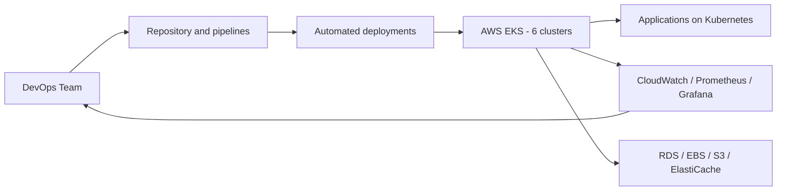

## 🚀 Featured Projects

### 1. **AWS EKS Infrastructure Management & Scaling (Banco Santander)**

**Description:**
Responsible for maintenance, upgrades, and deployment of applications across 6 Kubernetes clusters on AWS EKS. I manage day-to-day operations, optimization, and scaling of production cloud infrastructure.

**Achievements:**
- ✅ 99.9% production uptime
- ✅ 6 Kubernetes clusters (DEV/UAT/PROD multi-region)
- ✅ Infrastructure cost optimization
- ✅ Complete deployment automation with IaC (Terraform)

**Tech Stack:**
- **Orchestration:** AWS EKS, Kubernetes, Helm
- **IaC:** Terraform, CloudFormation
- **CI/CD:** Jenkins, GitHub Actions, UrbanCode
- **Monitoring:** CloudWatch, Prometheus, Grafana
- **Storage:** EBS, RDS, S3, ElastiCache

**Responsibilities:**
- 50+ monthly coordinated deployments
- EKS version upgrades with zero downtime
- IAM permissions and security management
- CloudWatch dashboards and alerting
- Incident support and resolution
- Documentation and best practices

**Simple project diagram:**

---

### 2. **Enterprise Automation Team (UST Global)**

**Description:**
Experience in the **Automation** team working on infrastructure and DevOps tools for the Santander project. I trained on multiple platforms and infrastructure management tools, across public cloud (AWS, Azure) and private cloud (OHE).

**Achievements:**
- ✅ Mastery of multiple DevOps tools
- ✅ Multi-cloud experience (AWS, Azure, On-Premise)
- ✅ Enterprise ticketing integration (ServiceNow)
- ✅ Python automation script development

**Tech Stack:**
- **Orchestration:** Rundeck, Jenkins, UrbanCode
- **Cloud:** AWS, Microsoft Azure, OHE (private)
- **Monitoring:** Dynatrace, CloudWatch
- **Automation:** Ansible, Python, Bash
- **Networking:** Infoblox, PSP
- **Version Control:** GitHub, GitLab

**Key Learnings:**
- Job scheduling and automation tools
- Enterprise incident management
- Heterogeneous systems integration
- Automation best practices

---

### 3. **DevOps Tools & Cloud Training (Luca Tic)**

**Description:**
As a **DevOps Engineer Junior**, I participated in the Coches.com project where I received in-depth training in key DevOps ecosystem tools and technologies. I completed Pluralsight certifications in AWS and Azure during this period.

**Achievements:**
- ✅ Mastery of Terraform as primary IaC
- ✅ GitOps orchestration experience (ArgoCD)
- ✅ Certifications: AWS SysOps, Azure AZ-104, Azure AZ-900
- ✅ Complete Kubernetes-Docker stack proficiency

**Tech Stack:**
- **IaC:** Terraform, ArgoCD
- **CI/CD:** Jenkins, GitLab CI, GitHub Actions
- **Containerization:** Docker, Kubernetes
- **Cloud:** AWS (SysOps), Azure (AZ-104, AZ-900)
- **Version Control:** GitHub, GitLab

**Training Focus:**
- Terraform: from fundamentals to advanced modules
- Kubernetes: deployments, services, ConfigMaps
- Docker: image creation, registries
- AWS: EC2, RDS, VPC, IAM, Lambda
- Azure: Virtual Machines, App Services, subscriptions
- GitOps with ArgoCD

**Project:**
- Coches.com - Cloud infrastructure and automation

---

## 📊 Global Metrics

| Metric | Value |
|--------|-------|
| **Kubernetes Clusters in Prod** | 6 |
| **Average Uptime** | 99.9% |
| **Deployment Frequency** | 50+ / month |
| **Lead Time** | < 10 minutes |
| **MTTR** | < 5 minutes |
| **Automation** | 95% |

---

## 🛠️ Technologies Used

**Top 5 by experience:**
1. **AWS** - EKS, EC2, RDS, Lambda, VPC
2. **Kubernetes** - Multi-cluster, Service Mesh, Helm
3. **Terraform** - IaC, state management, modules
4. **Jenkins** - Declarative pipelines, plugins, groovy
5. **Docker** - Optimized Dockerfiles, private registries

---

## 📥 Want to know more details?

You can download my full CV or contact me directly:

- 📧 **Email:** [angelocho64@gmail.com](mailto:angelocho64@gmail.com)
- 🔗 **LinkedIn:** [linkedin.com/in/angel-bocalandro](https://linkedin.com/in/ángel-bocalandro-ruiz-ab7221231/)
- 💻 **GitHub:** [github.com/angelocho](https://github.com/angelocho)
