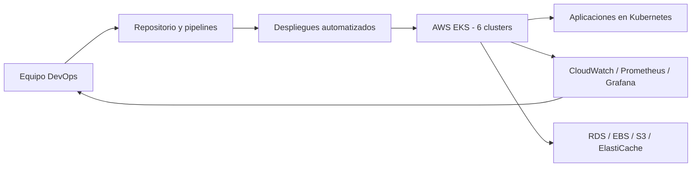

## 🚀 Proyectos Destacados

### 1. **Administración & Escalado de Infraestructura EKS (Banco Santander)**

**Descripción:**
Responsable del mantenimiento, upgrades y despliegue de aplicaciones en 6 clústeres Kubernetes en AWS EKS. Me encargo de la administración diaria, optimización y escalado de la infraestructura cloud en producción.

**Logros:**
- ✅ 99.9% de uptime en producción
- ✅ 6 clústeres Kubernetes (DEV/UAT/PROD multi-región)
- ✅ Optimización y reducción de costos de infraestructura
- ✅ Automatización completa de despliegues con IaC (Terraform)

**Stack Tecnológico:**
- **Orquestación:** AWS EKS, Kubernetes, Helm
- **IaC:** Terraform, CloudFormation
- **CI/CD:** Jenkins, GitHub Actions, UrbanCode
- **Monitoreo:** CloudWatch, Prometheus, Grafana
- **Storage:** EBS, RDS, S3, ElastiCache

**Responsabilidades:**
- Deployments: 50+ mensuales coordinados
- Upgrades de versión en EKS sin downtime
- Gestión de permisos IAM y seguridad
- Dashboards y alarmas en CloudWatch
- Soporte y resolución de incidencias
- Documentación y best practices

**Diagrama simple del proyecto:**

---

### 2. **Equipo de Automatización Enterprise (UST Global)**

**Descripción:**
Experiencia en el equipo de **Automation** trabajando en infraestructura y herramientas DevOps para el proyecto Santander. Me formé en diversas plataformas y herramientas de gestión de infraestructura, tanto en cloud público (AWS, Azure) como privado (OHE).

**Logros:**
- ✅ Dominio de múltiples herramientas DevOps
- ✅ Experiencia multi-cloud (AWS, Azure, On-Premise)
- ✅ Integración con ticketing enterprise (ServiceNow)
- ✅ Desarrollo de scripts de automatización en Python

**Stack Tecnológico:**
- **Orquestación:** Rundeck, Jenkins, UrbanCode
- **Cloud:** AWS, Microsoft Azure, OHE (privada)
- **Monitoreo:** Dynatrace, CloudWatch
- **Automatización:** Ansible, Python, Bash
- **Networking:** Infoblox, PSP
- **Control de versiones:** GitHub, GitLab

**Aprendizajes:**
- Herramientas de job scheduling y automation
- Gestión de incidencias enterprise
- Integración de sistemas heterogéneos
- Buenas prácticas en automatización

---

### 3. **Formación DevOps en Herramientas Cloud (Luca Tic)**

**Descripción:**
Como **DevOps Engineer Junior**, participé en proyecto Coches.com donde me formé profundamente en las herramientas y tecnologías clave del ecosistema DevOps moderno. Completé certificaciones de Pluralsight en AWS y Azure durante este período.

**Logros:**
- ✅ Dominio de Terraform como IaC principal
- ✅ Experiencia con orquestación GitOps (ArgoCD)
- ✅ Certificaciones: AWS SysOps, Azure AZ-104, Azure AZ-900
- ✅ Manejo completo del stack Kubernetes-Docker

**Stack Tecnológico:**
- **IaC:** Terraform, argoCD
- **CI/CD:** Jenkins, GitLab CI, GitHub Actions
- **Containerización:** Docker, Kubernetes
- **Cloud:** AWS (SysOps), Azure (AZ-104, AZ-900)
- **Control de versiones:** GitHub, GitLab

**Formación:**
- Terraform desde fundamentos hasta módulos avanzados
- Kubernetes: deployment, servicios, ConfigMaps
- Docker: creación de imágenes, registries
- AWS: EC2, RDS, VPC, IAM, Lambda
- Azure: Virtual Machines, App Services, subscriptions
- GitOps con ArgoCD

**Proyecto:**
- Coches.com - Infraestructura cloud y automatización

---

## 📊 Métricas Globales

| Métrica | Valor |
|---------|-------|
| **Clústeres Kubernetes en Prod** | 6 |
| **Uptime Promedio** | 99.9% |
| **Deployment Frequency** | 50+ / mes |
| **Lead Time** | < 10 minutos |
| **MTTR** | < 5 minutos |
| **Automatización** | 95% |

---

## 🛠️ Tecnologías Utilizadas

**Top 5 por experiencia:**
1. **AWS** - EKS, EC2, RDS, Lambda, VPC
2. **Kubernetes** - Multi-cluster, Service Mesh, Helm
3. **Terraform** - IaC, state management, modules
4. **Jenkins** - Pipeline declarativo, plugins, groovy
5. **Docker** - Dockerfiles optimizados, registries privados

---

## 📥 ¿Quieres conocer más detalles?

Puedes descargar mi CV completo o contactarme directamente:

- 📧 **Email:** [angelocho64@gmail.com](mailto:angelocho64@gmail.com)
- 🔗 **LinkedIn:** [linkedin.com/in/angel-bocalandro](https://linkedin.com/in/ángel-bocalandro-ruiz-ab7221231/)
- 💻 **GitHub:** [github.com/angelocho](https://github.com/angelocho)
